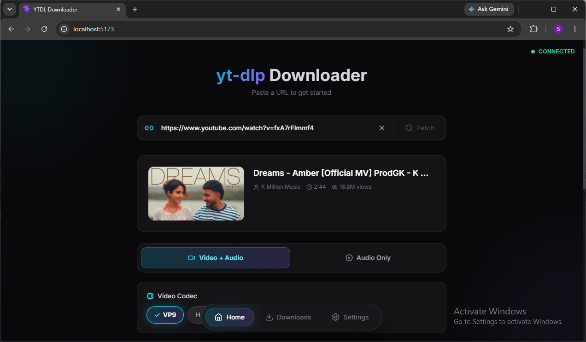
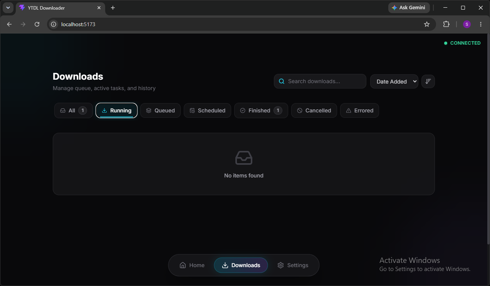
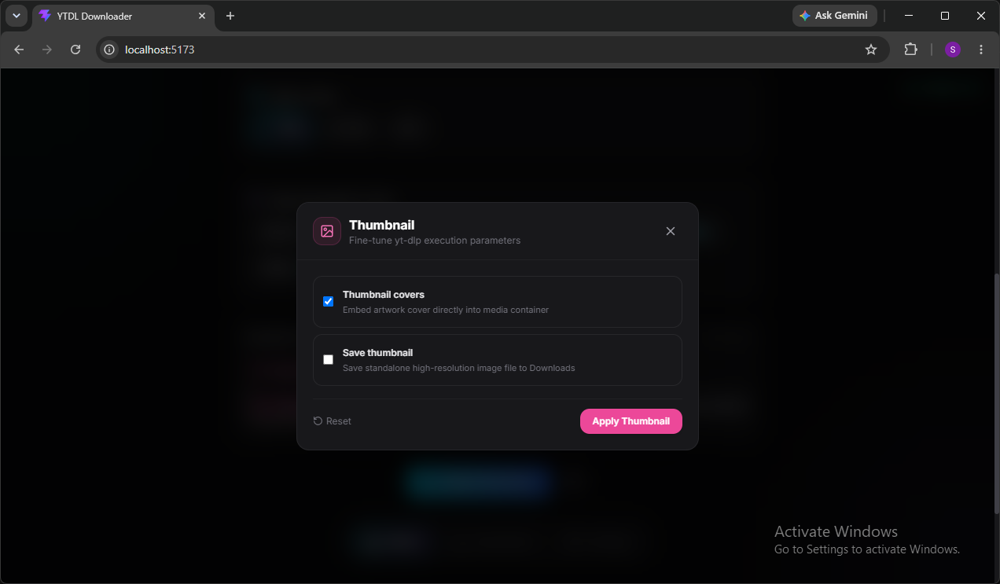
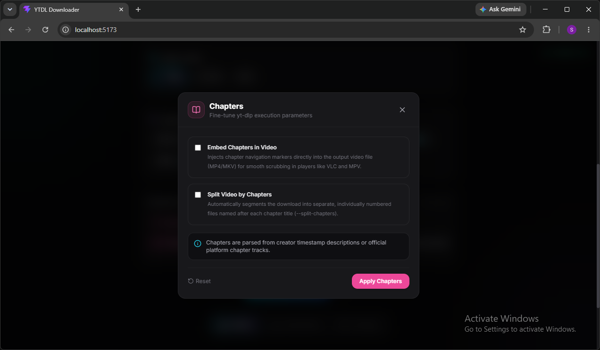
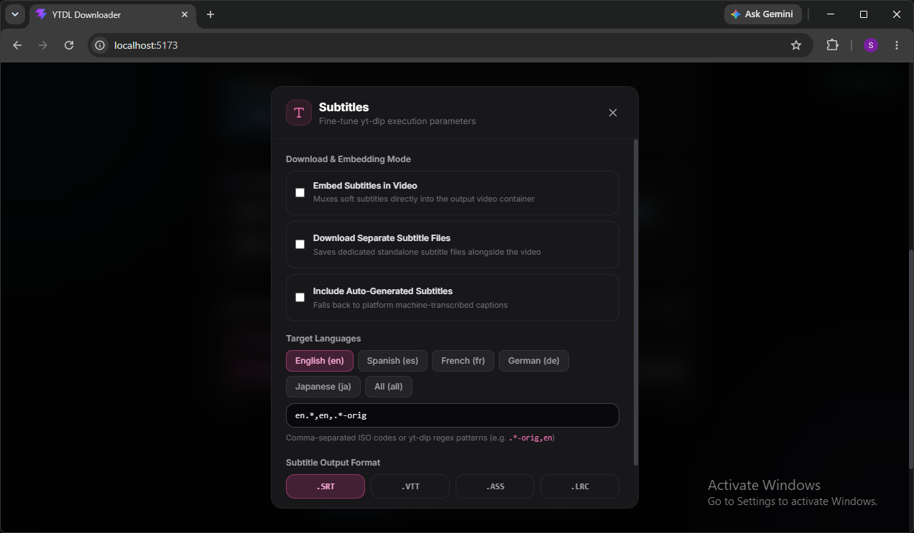
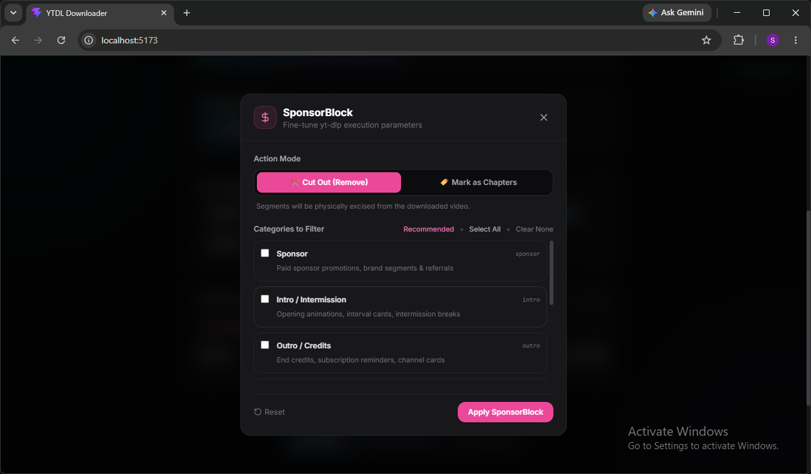
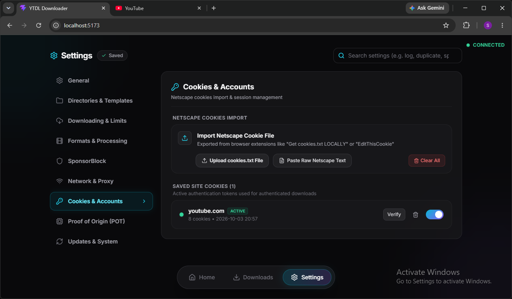

<div align="center">

  

  # YTDL Downloader
  ### A Modern, Feature-Packed Full-Stack Web Interface for yt-dlp

  [](#prerequisites)
  [](#backend)
  [](#frontend)
  [](https://github.com/yt-dlp/yt-dlp)
  [](https://hub.docker.com/r/sunilshahid/yt-downloader)
  [](#license)

  <p align="center">
    <b>YTDL Downloader</b> brings the unmatched power of <code>yt-dlp</code> into a polished, responsive, and reactive web application. Packed with visual video trimming, interactive crop geometry, YouTube Proof of Origin (PO Token) generation, multi-account cookie management, live byte-level progress streaming, and granular post-processing overrides.
  </p>

  <p align="center">
    <a href="#quick-start">Quick Start</a> •
    <a href="#key-features">Key Features</a> •
    <a href="#screenshots">Screenshots</a> •
    <a href="#architecture">Architecture</a> •
    <a href="#configuration">Configuration</a> •
    <a href="#docker">Docker</a> •
    <a href="#troubleshooting">Troubleshooting</a>
  </p>

</div>

---

<a id="key-features"></a>
## 🌟 Key Features & Highlights

- **⚡ Full-Stack in One Command**: Run the entire application (FastAPI backend + optimized production React SPA) with a single command: `python main.py`.
- **✂️ Visual Video Trimming (Cut)**: Interactive range scrubbing, multi-segment time slicing, and dual mode operation (keep selected slices or cut out intervals).
- **📐 Interactive Crop Geometry**: Drag-and-drop crop overlay with locked aspect ratios (16:9, 4:3, 1:1, 9:16) and direct FFmpeg filter synthesis.
- **🛡️ Proof of Origin (PO Token) Engine**: Headless BgUtils challenge execution and BotGuard token minting to bypass YouTube 403 Forbidden errors.
- **🍪 Multi-Account & Individual Cookie Manager**: Import Netscape-formatted cookies, manage site-specific accounts, and toggle individual sessions per domain.
- **🚫 SponsorBlock Integration**: Automatically excise paid promotions, intros, and filler segments or mark them as navigable chapters.
- **📜 Live Terminal Logs & Command Reconstructor**: Real-time WebSocket log streaming with stage-by-stage progress hooks and full yt-dlp CLI command reconstruction.
- **🎛️ Advance Options & Reactive Synchronization**: Per-video download overrides that dynamically inherit from global settings and revert cleanly on subsequent requests.
- **🕵️ Incognito Mode**: Zero-trace downloading with history wiping, private sessions, and hidden staging artifacts.

---

<a id="quick-start"></a>
## 🚀 Quick Start

### Prerequisites

Make sure the following tools are installed on your system:
- **Python 3.10+** (Python 3.11 or 3.12/3.13 recommended)
- **FFmpeg**: Required for audio extraction, muxing, cropping, and thumbnail embedding ([Download FFmpeg](https://ffmpeg.org/download.html))
- *(Optional)* **aria2c**: Required if you enable multi-connection accelerated downloading

### 1. Clone the Repository

```bash
git clone https://github.com/sunilshahid/YT-downloader.git
cd YT-downloader
```

---

### 2. Choose Your Way to Run

You can run the entire full-stack application (React UI + FastAPI + yt-dlp) in two easy ways:

#### ⚡ Option A: Native Python (Single Command)

FastAPI serves the pre-built React frontend and all API/WebSocket endpoints together:

```bash
# 1. Install Python dependencies
pip install -r backend/requirements.txt

# 2. Run the application
cd backend
python main.py
```

Access the UI at: **`http://localhost:8000`**

---

#### 🐳 Option B: Docker (Pre-Built or Local Build)

Run everything inside a self-contained container with FFmpeg, aria2, and Node.js pre-installed:

**1. Run Directly from Docker Hub (Fastest — No Build Needed):**
```bash
docker run -d \
  --name yt-downloader \
  -p 8000:8000 \
  -v ./backend/data:/app/backend/data \
  -v ./Downloads:/downloads \
  sunilshahid/yt-downloader:latest
```

**2. Or Using Docker Compose:**
```bash
docker compose up -d
```

**3. Or Build Locally with Docker CLI:**
```bash
docker build -t yt-downloader .
docker run -d \
  --name yt-downloader \
  -p 8000:8000 \
  -v ./backend/data:/app/backend/data \
  -v ./Downloads:/downloads \
  yt-downloader
```

Access the UI at: **`http://localhost:8000`**

---

## 🛠️ Development Mode (Optional)

If you wish to modify the React frontend with hot-module replacement (HMR):

1. **Start the Backend**:
   ```bash
   cd backend
   python main.py
   ```

2. **Start the Vite Dev Server**:
   ```bash
   cd frontend
   npm install
   npm run dev
   ```

3. Open **`http://localhost:5173`** for local development.

To rebuild the production assets after making frontend edits:
```bash
cd frontend
npm run build
```

---

<a id="screenshots"></a>
<a id="screenshots-walkthrough"></a>
## 📸 Screenshots Walkthrough

### 1. Modern Dashboard & Video Discovery
A clean, dark-mode user interface featuring instant URL parsing, format inspection, download scheduling, incognito browsing, and fast search history.

| Home Dashboard | Downloads & Sub-Tabs | Codec & Quality Selection |
| :---: | :---: | :---: |
|  |  |  |

---

### 2. Visual Video Trimming & Crop Geometry
Precision video editing before downloading begins. Cut multiple segments or excise filler, and crop frames using interactive aspect-ratio bounding boxes.

| Interactive Timeline Trimmer | Aspect-Ratio Crop Geometry |
| :---: | :---: |
|  |  |

- **Time-Slice Trimmer**: Precise scrubbing with live preview, multi-segment markers, and automatic overlapping interval merging.
- **Crop Geometry Engine**: Visual bounding box with rule-of-thirds grid, corner/edge drag handles, and resolution scaling (`crop=w:h:x:y`).

---

### 3. Advance Options & Post-Processing
Fine-tune yt-dlp execution parameters on a per-video basis or configure system-wide defaults in Settings.

| Thumbnail Embedding | Chapter Control | Subtitles Manager |
| :---: | :---: | :---: |
|  |  |  |

| SponsorBlock Filtering | Container & Codec Overrides |
| :---: | :---: |
|  |  |

- **Thumbnails**: High-resolution cover embedding or standalone `.jpg`/`.webp` image extraction.
- **Chapters**: Native metadata chapter embedding or automatic splitting into individually numbered files (`--split-chapters`).
- **Subtitles**: Multi-language selection, auto-generated platform caption fallback, and soft-sub muxing (`.srt`, `.vtt`, `.ass`, `.lrc`).
- **SponsorBlock**: Excises sponsored segments, self-promotions, interaction reminders, and intros.

---

### 4. Enterprise Engine: Cookies & Anti-Bot Bypasses
Overcome platform blocks, age-restrictions, and rate-limits with dedicated session and token tooling.

| Proof of Origin (PO Token) | Multi-Account Cookie Manager |
| :---: | :---: |
|  |  |

- **YouTube Proof of Origin (PO Token)**: Mint guest and authenticated BotGuard tokens via headless BgUtils integration to bypass HTTP 403 Forbidden throttling.
- **Netscape Cookie Session Manager**: Add, edit, test, and toggle site-specific cookies for YouTube Premium, age-restricted videos, and member-only streams.

---

### 5. Transparency & System Controls
Inspect live execution internals and keep your downloader up-to-date with upstream extractors.

| Real-Time Execution Logs & CLI Reconstructor | Private Incognito Mode | Release Channel Updates |
| :---: | :---: | :---: |
|  |  |  |

- **Log Streaming & CLI Reconstructor**: Live terminal output paired with a 1:1 reconstructed CLI equivalent command that you can copy and re-run anywhere.
- **Incognito Mode**: Disables history logging and wipes intermediate files immediately after download.
- **Update System**: Switch between **Stable**, **Nightly**, and **Master** git channels with one click directly from the UI.

---

<a id="architecture"></a>
## 🏗️ Architecture

```
YT-downloader/
├── backend/
│   ├── main.py                  # FastAPI application & SPA static router
│   ├── downloader.py            # yt-dlp wrapper, progress hooks & post-processors
│   ├── models.py                # Pydantic schemas & validation models
│   ├── settings_manager.py      # Thread-safe persistent settings manager
│   ├── cookie_service.py        # Netscape cookie storage & domain parser
│   ├── po_token_service.py      # Proof of Origin (PO Token) generation service
│   ├── requirements.txt         # Backend Python dependencies
│   └── data/                    # Staging, logs, history, and configuration storage
├── frontend/
│   ├── dist/                    # Compiled production assets (served by FastAPI)
│   ├── src/
│   │   ├── components/          # React components (HomeTab, FormatSelector, Modals)
│   │   ├── hooks/               # WebSocket & Settings hooks
│   │   └── App.jsx              # Main application shell
│   ├── package.json             # Frontend dependencies & build scripts
│   └── vite.config.js           # Vite build & bundler configuration
├── screenshots/                 # Showcase screenshots
└── favicon.svg                  # Application brand icon
```

### Full-Stack Dataflow
1. **Client Interaction**: User configures download parameters in React (format, cuts, crop, cookies, PO token).
2. **WebSocket & REST**: Backend accepts request via FastAPI (`POST /api/download`) and assigns a unique task UUID.
3. **In-Process yt-dlp Pipeline**: Runs directly inside Python bindings with custom progress hooks and real-time output interception.
4. **Post-Processing Chain**: FFmpeg performs stream remuxing, video slicing, audio extraction, thumbnail embeds, and chapter splitting.
5. **Real-Time Broadcast**: Progress queue streams speed, ETA, percentage, and log lines to all connected WebSocket clients.

---

<a id="configuration"></a>
## ⚙️ Configuration & Settings

The settings panel allows you to customize every aspect of your downloading pipeline:

| Category | Key Options | Description |
| :--- | :--- | :--- |
| **General** | `theme`, `incognito_mode`, `save_search_history` | UI appearance, private downloading, and search caching |
| **Directories** | `download_dir`, `subdirectory_format`, `filename_template` | Output folder location and customizable filename token formatting |
| **Downloading** | `concurrent_downloads`, `speed_limit`, `retries`, `aria2` | Concurrency, rate limits, network retries, and aria2c acceleration |
| **Formats** | `default_container`, `preferred_codec`, `audio_quality` | Preferred video containers (MP4/MKV/WebM) and audio codecs |
| **SponsorBlock** | `sponsorblock_remove`, `sponsorblock_categories` | Auto-removal of promotional segments and category filtering |
| **Network** | `proxy_url`, `geo_bypass`, `custom_user_agent` | SOCKS5/HTTP proxies, geo-restriction bypass, and headers |
| **Cookies** | `site_cookies`, `cookies_enabled` | Per-domain Netscape session cookies management |
| **PO Token** | `bgutil_base_url`, `player_clients`, `use_only_po_token` | YouTube anti-bot Proof of Origin token minting |
| **Updates** | `ytdlp_release_channel`, `auto_update` | Automatic updates tracking Stable or Nightly channels |

---

<a id="docker"></a>
<a id="docker-deployment"></a>
## 🐳 Docker & Container Deployment

YTDLnis Web includes an optimized, production-ready multi-stage Docker build that bundles the built React frontend, FastAPI backend, FFmpeg, aria2, and Node.js into a single unified container.

### 1. Build the Unified Image
Thanks to the included `.dockerignore` and layer caching, builds are fast and lightweight:

```bash
docker build -t yt-downloader .
```

### 2. Run the Container
```bash
docker run -d \
  --name yt-downloader \
  -p 8000:8000 \
  -v ./backend/data:/app/backend/data \
  -v ./Downloads:/downloads \
  yt-downloader
```

Access the full stack web application at: **http://localhost:8000**

### 3. Docker Compose (One-Command Startup)
```bash
docker compose up -d
```

### 🪟 Windows & Lightweight WSL2 Setup
On Windows, Docker Desktop utilizes WSL2. A lightweight setup has been pre-configured:
1. **Lightweight Resource Limits (`.wslconfig`)**: Limits memory to 2GB and 2 CPUs so your host system never slows down.
2. **1-Click Virtualization & WSL Setup**:
   - Right-click `setup-wsl-docker.bat` and select **"Run as administrator"**.
   - It enables Windows Virtual Machine Platform and installs Debian (lightweight distro, ~80MB).
   - If prompted, restart your PC once so Windows loads the hypervisor, then launch Docker Desktop!

---

<a id="troubleshooting"></a>
## ❓ Troubleshooting

### 1. HTTP 403 Forbidden on YouTube Downloads
- Navigate to **Settings &rarr; Proof of Origin (PO Token)**.
- Enable Proof of Origin generation and click **Test Token Generation**.
- Ensure a valid Netscape cookie is configured under **Settings &rarr; Cookies & Accounts**.

### 2. FFmpeg Not Detected
- Ensure `ffmpeg` and `ffprobe` are installed and available in your system's `PATH`.
- On Windows, install via winget: `winget install Gyan.FFmpeg`.
- On macOS, install via Homebrew: `brew install ffmpeg`.
- On Linux, install via apt: `sudo apt install ffmpeg`.

### 3. Port 8000 Already in Use
- Run with a custom port:
  ```bash
  uvicorn main:app --host 127.0.0.1 --port 8080
  ```

---

<a id="license"></a>
## 📄 License

This project is open-source and available under the [MIT License](LICENSE).

---

<div align="center">
  <sub>Built with ❤️ using FastAPI, React, and yt-dlp.</sub>
</div>
